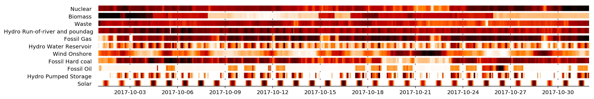
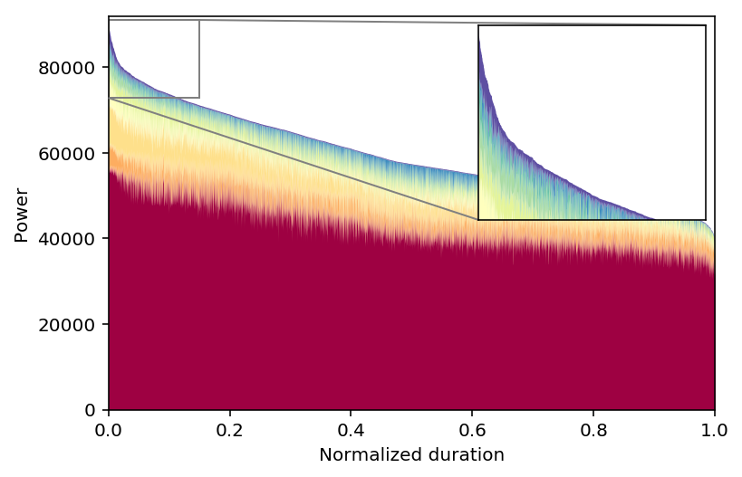

Python toolkit for energy load time series
==========================================

|pyversion| |anaconda| |license| |version_status| |build_status| |docs| |cover| |binder|

``enlopy`` is an open source python library with methods to generate,
process, analyze, and plot timeseries.

While it can be used for any kind of data it has a strong focus on those
that are related with energy i.e. electricity/heat demand or generation,
prices etc. The methods included here are carefully selected to
fit in that context and they had been, gathered, generalized and
encapsulated during the last years while working on different research
studies.

The aim is to provide a higher level API than the one that is already
available in commonly used scientific packages (pandas, numpy, scipy).
This facilitates the analysis and processing of energy load timeseries
that can be used for modelling and statistical analysis. In some cases it
is just a convenience wrapper of common packages just as pandas and in
other cases, it implements methods or statistical models found in
literature.

It consists of four modules that include among others the following:

* ``Analysis``: Overview of descriptive statistics, reshape, load duration curve, extract daily archetypes (clustering), detect outliers
* ``Plot``: 2d heatmap, 3d plot, boxplot, rugplot, percentiles
* ``Generate``: generate from daily and monthly profiles, generate from sinusoidal function, sample from given load duration curve, or from given spectral distribution, add noise gaussian and autoregressive noise, generate correlated load profiles, fit to analytical load duration curve
* ``Statistics``: Feature extraction from timeseries for a quick overview of the characteristics of any load curve. Useful when coupled with machine learning packages.

The library is designed to be robust enough to accept a wide range of inputs (pd.Dataframe, pd.Series, np.ndarray, list)
This library is not focusing on regression and forecasting (e.g. ARIMA, state-space etc.), since there are numerous relevant libraries around.

Example
-------
Enlopy has a simple API and is easy to use see some example below:

>>>  # df is a pandas dataframe with an hourly DateTimeindex. Each column represents a different generation technology
>>> import enlopy as el
>>> el.plot_rug(df) # Plots a nice rugplot. Useful for dispatch results

>>> el.plot_LDC(df, zoom_peak=True) # Plots a cumulative Load Duration Curve with inset zoom plot 

Run the following code for some more examples:

.. code:: python

    >>> import numpy as np
    >>> import enlopy as el
    >>> Load = np.random.rand(8760)  # Create random vector of values
    >>> eload = el.make_timeseries(Load)  # Convenience wrapper around pandas timeseries

    >>> el.plot_heatmap(eload, x='day', y='month', aggfunc='mean')  # Plots 2d heatmap
    >>> el.plot_percentiles(eload)  # Plots mean and quantiles
    >>> el.get_load_archetypes(eload, plot_diagnostics=True)  # Splits daily loads in clusters (archetypes)
    >>> el.get_load_stats(eload, per=’m’)  # Get monthly load statistics
    >>> el.remove_outliers(eload, threshold=None, window=5, plot_diagnostics=True)  # Remove outliers and plot diagnostic

More examples can be found in `this jupyter notebook <https://github.com/kavvkon/enlopy/blob/master/notebooks/Basic%20examples.ipynb>`__. You can directly run an online interactive version of the notebook where you can explore all available features by clicking here |binder|.

Documentation
-------------
Detailed documentation is still under construction, but you can find an overview of the available methods here: http://enlopy.readthedocs.io/

Install
-------

The latest stable version exists in conda-forge and pypi. You can install it using `conda package manager <https://conda.io/en/latest/>`__ (recommended) by typing:

::

    conda install -c conda-forge enlopy

or if you prefer pypi

::

    pip install enlopy

Be aware that this library is still in conceptual mode, so the API may change in the upcoming versions.

It should be ready to run out of the box for anyone that has the
`anaconda distribution <https://www.anaconda.com/distribution/>`__
installed. The only dependencies required to use ``enlopy`` are the
following:

-  `numpy <http://numpy.org>`__
-  `scipy <http://scipy.org>`__
-  `pandas <http://pandas.pydata.org/>`__
-  `matpotlib <http://matplotlib.org/>`__

If you want to download the latest version from git for use or development purposes (assuming that you have anaconda installed):

.. code:: bash

    git clone https://github.com/kavvkon/enlopy.git
    cd enlopy
    conda env create  # Automatically creates environment based on environment.yml
    source activate enlopy
    pip install -e . # Install editable local version

Contribute
----------

My vision is to make this library a energy domain-specific wrapper that can be used for any kind of energy analysis or modelling.
If you think you can contribute with new relevant methods that you are
currently using or improve the code or documentation in any way, feel free to contact me,
fork the repository and send your pull requests.

Citing
------

If you use this library in an academic work, please consider citing it.

[1] K. Kavvadias, “enlopy: Python toolkit for energy load time series”, http://github.com/kavvkon/enlopy

``enlopy`` has been already used for processing demand timeseries in this scientific paper:
http://dx.doi.org/10.1016/j.apenergy.2016.08.077

.. |pyversion| image:: https://img.shields.io/pypi/pyversions/enlopy.svg
    :alt: Supported Python versions.
    :target: https://pypi.python.org/pypi/enlopy
.. |license| image:: https://img.shields.io/pypi/l/enlopy.svg
    :alt: BSD License
    :target: https://opensource.org/licenses/BSD-3-Clause
.. |version_status| image:: https://img.shields.io/pypi/v/enlopy.svg?style=flat
   :target: https://pypi.python.org/pypi/enlopy
.. |build_status| image:: https://img.shields.io/travis/kavvkon/enlopy/master.svg?style=flat
   :target: https://travis-ci.org/kavvkon/enlopy
.. |docs| image:: https://readthedocs.org/projects/enlopy/badge/
    :alt: Documentation
    :target: https://enlopy.readthedocs.io/en/latest/
.. |cover| image:: https://coveralls.io/repos/github/kavvkon/enlopy/badge.svg?branch=master
    :target: https://coveralls.io/github/kavvkon/enlopy?branch=master
.. |anaconda| image:: https://anaconda.org/conda-forge/enlopy/badges/installer/conda.svg
    :target: https://anaconda.org/conda-forge/enlopy
.. |binder| image:: https://mybinder.org/badge_logo.svg
    :target: https://mybinder.org/v2/gh/kavvkon/enlopy/master?filepath=notebooks%2FBasic%20examples.ipynb

